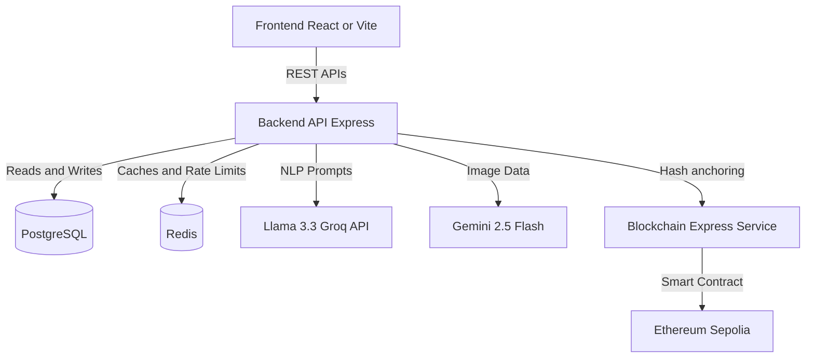

# 🧠 System Architecture & Design

This document outlines the architecture, data flow, and component relationships for the **Nexora** platform.

---

## 1. High-Level Architecture

The Nexora ecosystem operates on a standard 3-tier architecture, augmented by an AI processing engine and an immutable blockchain ledger.

## 2. Core Components

### A. The Capture Layer (Frontend)
- **Responsibility**: Provides the user interface for expense management, receipt uploads, and voice recording.
- **Tech**: React 18, Vite, Tailwind CSS, Shadcn.
- **Flow**: 
  - Audio blobs are converted to text or sent directly to the backend.
  - Receipt images are sent as multipart/form-data.
  - JWT tokens are attached via Axios/Fetch interceptors.

### B. The Processing Layer (Backend API)
- **Responsibility**: The central brain. Handles authentication, validation, routing, and invokes AI models.
- **Tech**: Node.js, Express.js.
- **AI Processing Pipeline**:
  - **Text/Voice**: Handed off to Llama 3.3 via Groq for entity extraction (Who paid? How much? Split logic?).
  - **Images**: Sent to Gemini 2.5 Flash. Prompt engineering enforces strict JSON schemas for returned line items and amounts.
  
### C. The Storage Layer (Database)
- **Responsibility**: Relational mapping of Users, Groups, Expenses, and Settlements.
- **Tech**: PostgreSQL (via Prisma or direct pg drivers).
- **Caching**: Redis is utilized to track API request limits, avoiding spam and managing costly AI invocation rates.

### D. The Audit Layer (Blockchain)
- **Responsibility**: Ensuring expenses and ledger entries cannot be tampered with maliciously by admins or database breaches.
- **Tech**: Ethereum Sepolia, Ethers.js.
- **Flow**:
  1. Expense is saved to PostgreSQL.
  2. Backend generates a deterministic hash of the expense payload.
  3. Backend fires an asynchronous HTTP request to the internal Blockchain Microservice.
  4. Microservice anchors the hash into a Smart Contract and returns the TxHash.

---

## 3. Security Considerations

- **Memory-only Uploads**: Receipt images are processed in-memory using `multer` buffers. They are never written to persistent disk storage, mitigating local storage leaks.
- **Role-Based Access (RBAC)**: Users can only see groups they are members of. Expense modifications are restricted to creators or admins.
- **Data Integrity**: The dual database-blockchain model ensures that the relational database operates at high speed, while critical financial anchors are synced to an immutable ledger asynchronously.
